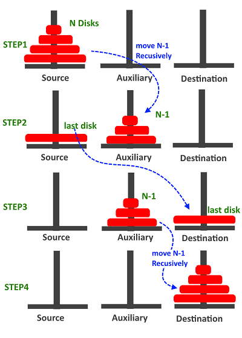

# Tower of Hanoi

Tower of Hanoi is a mathematical puzzle where we have three rods and 'n' number of disks. The objective of the puzzle is to move the entire stack of disks from one rod to another rod.

## The following rules must be obeyed to solve the puzzle-

* Only one disk can be moved at a time.

* Each move consists of taking the upper disk from one of the stacks and placing it on top of another stack _i.e. a disk can only be moved if it is the uppermost disk on a stack._

* No disk may be placed on top of a smaller disk.

### Image illustration for 'N' Disks-



### Program in C -

```C
//An example of a C recursive function, Tower of Hanoi.

#include <stdio.h> 
void TOH (int n, char A, char C, char B) 
{ 
    if (n == 1) 
    { 
        printf("\n Move disk 1 from rod %c to rod %c", A, C); 
        return; 
    } 
    TOH (n-1, A, B, C); 
    printf("\n Move disk %d from rod %c to rod %c", n, A, C); 
    TOH (n-1, B, C, A); 
} 
int main() 
{ 
    int n=4; // Number of disks  
    TOH (n, 'A', 'C', 'B');  // A, B and C are names of rods 
    return 0; 
} 
```

### Output-

```.

 Move disk 1 from rod A to rod B
 Move disk 2 from rod A to rod C
 Move disk 1 from rod B to rod C
 Move disk 3 from rod A to rod B
 Move disk 1 from rod C to rod A
 Move disk 2 from rod C to rod B
 Move disk 1 from rod A to rod B
 Move disk 4 from rod A to rod C
 Move disk 1 from rod B to rod C
 Move disk 2 from rod B to rod A
 Move disk 1 from rod C to rod A
 Move disk 3 from rod B to rod C
 Move disk 1 from rod A to rod B
 Move disk 2 from rod A to rod C
 Move disk 1 from rod B to rod C
```

### Basic Logic-

A, B and C are rods or pegs and n is the total number of discs, 4 is the largest disk and 1 is the smallest one.

* The **n-1** discs are moved from rod A to B using recursive function and disc **n** is left alone in the rod A.

* The disc **n** is transferred from the rod A to C.

* The **n-1** discs are transferred from the rod B to C using recursive function so that they sit over disc **n** .
  